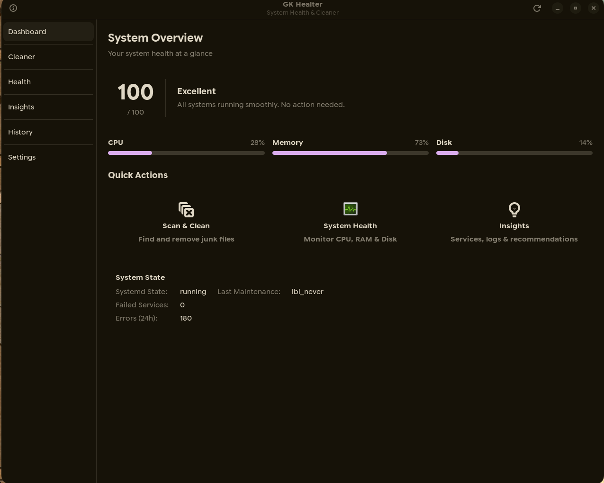

# Zerra System Cleaner

Zerra System Cleaner is a professional, lightweight system maintenance utility designed for Linux desktops. It emphasizes safety and efficiency, providing users with a reliable way to recover disk space by identifying and removing redundant files without compromising system stability.

## Key Features

- **Package Management:** Clean APT environment, including downloaded package archives and partial files.
- **System Maintenance:** Remove redundant system logs and vacuum the system journal.
- **Application Hygiene:** Clear application-specific data such as browser caches and thumbnail galleries.
- **Automated Operations:** Intelligent maintenance engine that can be scheduled based on system idle time or disk usage thresholds.
- **Detailed Tracking:** Comprehensive history of all cleaning operations and the total space recovered.
- **Native Experience:** Built with a modern GTK interface that respects system themes and dark mode settings.

## Screenshot



## Technology Stack

- **Language:** [Python 3](https://www.python.org/)
- **GUI Toolkit:** [GTK 3 (PyGObject)](https://pygobject.readthedocs.io/)
- **Build System:** [Meson](https://mesonbuild.com/)
- **Packaging:** [Flatpak](https://flatpak.org/)

## Installation from Flathub

Once the application is published on Flathub, you can install it using:

```bash
flatpak install flathub io.github.mustafa4631.ZerraSystemCleaner
```

To run the application:

```bash
flatpak run io.github.mustafa4631.ZerraSystemCleaner
```

## Build from Source

To build and install the application directly onto your system using Meson:

```bash
# Clone the repository
git clone https://github.com/mustafa4631/zerra-system-cleaner.git
cd zerra-system-cleaner

# Setup the build directory
meson setup _build

# Compile and install
sudo meson install -C _build
```

## Local Flatpak Build Instructions

To build and test the Flatpak package locally:

```bash
# Install flatpak-builder
sudo apt install flatpak-builder

# Build and install locally
flatpak-builder --user --install --force-clean build-dir io.github.mustafa4631.ZerraSystemCleaner.yml
```

## Contributing Guidelines

Contributions are welcome to help improve Zerra System Cleaner. You can contribute by reporting bugs, suggesting new cleaning modules, or submitting pull requests for code improvements and translations.

## Support

If you find this project useful, you can support its development through GitHub issues by providing feedback. Optional financial support is appreciated but never required for continued use of the software.

## License

This project is licensed under the **MIT License**. See the [LICENSE](LICENSE) file for details.

## Project Links

- **Homepage:** [https://github.com/mustafa4631/zerra-system-cleaner](https://github.com/mustafa4631/zerra-system-cleaner)
- **Bug Tracker:** [https://github.com/mustafa4631/zerra-system-cleaner/issues](https://github.com/mustafa4631/zerra-system-cleaner/issues)
- **Source Code:** [https://github.com/mustafa4631/zerra-system-cleaner](https://github.com/mustafa4631/zerra-system-cleaner)
